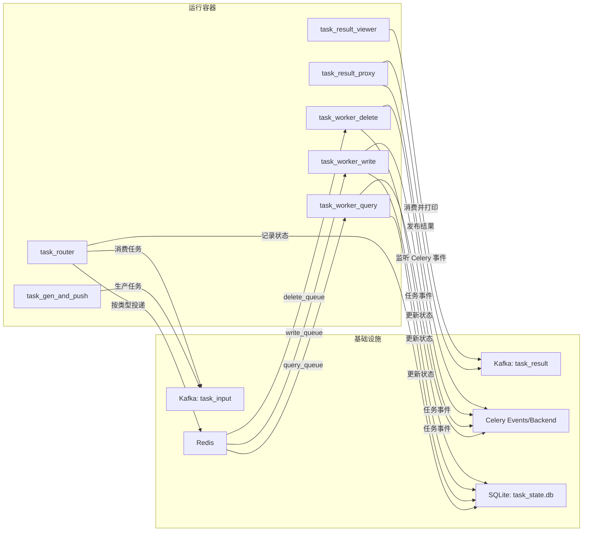

# task_flow_demo

一个基于 Kafka + Celery + Redis 的任务流转演示项目。

当前仓库实现的是容器化的"任务生成 → 路由 → Worker 执行 → 结果回传 → 结果展示"闭环，并包含 SQLite 任务状态持久化。

完整规划见 [ROADMAP.md](./ROADMAP.md)。

## 当前实现架构



## 系统原理说明

系统采用事件驱动与异步解耦模型，将"任务生产、任务分发、任务执行、结果回传"拆分为独立职责：

1. 任务生成阶段
   `task_gen_and_push` 按 `QPS` 生成随机任务（包含任务类型、执行时长、是否成功），写入 Kafka 输入主题 `task_input`。
2. 路由分发阶段
   `task_router` 消费 `task_input`，校验任务结构后按 `task_type` 分发到 Celery 对应队列（`query_queue`/`write_queue`/`delete_queue`），**并在 SQLite 中创建任务状态记录**。
3. 执行阶段
   三个 `task_worker_*` 容器分别监听自己的队列并执行任务，执行结果由 Celery Backend 记录，执行事件通过 Celery Events 发出，**同时更新 SQLite 中的任务状态**。
4. 结果聚合阶段
   `task_result_proxy` 订阅 Celery 成功/失败事件，补齐任务结果信息并写回 Kafka 输出主题 `task_result`。
5. 结果消费阶段
   `task_result_viewer` 消费 `task_result`，将结果以 JSON 行输出，便于下游系统接入或日志采集。

该模型的核心原理是：

- Kafka 负责跨服务消息解耦与削峰，降低生产端和消费端耦合。
- Celery + Redis 负责任务执行调度与队列隔离，让不同任务类型可独立扩缩。
- **SQLite 负责任务状态持久化，记录任务从创建到完成的全生命周期状态流转**。
- 结果回传链路独立于执行链路，失败与成功都可统一聚合和观察。

## SQLite 任务状态表

### 表结构

| 字段名 | 类型 | 说明 |
|--------|------|------|
| id | VARCHAR(36) | 任务 UUID（主键） |
| task_type | VARCHAR(20) | 任务类型（query/write/delete） |
| task_name | VARCHAR(255) | 任务名称 |
| if_success | BOOLEAN | 模拟是否成功 |
| execution_time | INTEGER | 执行时长（秒） |
| status | VARCHAR(20) | 当前状态（pending/routed/executing/success/failed/timeout） |
| queue_name | VARCHAR(50) | 路由目标队列 |
| worker_hostname | VARCHAR(255) | 执行 worker 主机名 |
| result | VARCHAR(1024) | JSON 格式执行结果 |
| exception | VARCHAR(1024) | 异常信息 |
| traceback | VARCHAR(4096) | 堆栈跟踪 |
| created_at | DATETIME | 创建时间 |
| updated_at | DATETIME | 更新时间 |

### 任务状态流转

```
PENDING → ROUTED → EXECUTING → SUCCESS/FAILED/TIMEOUT
```

| 状态 | 说明 | 触发时机 |
|------|------|----------|
| PENDING | 待处理 | 任务刚被创建 |
| ROUTED | 已路由 | 任务已成功发送到 Celery 队列 |
| EXECUTING | 执行中 | Worker 开始处理任务 |
| SUCCESS | 成功 | 任务执行成功 |
| FAILED | 失败 | 任务执行失败（if_success=false） |
| TIMEOUT | 超时 | 任务执行超时（execution_time > TIMEOUT_THRESHOLD） |

## Docker 容器功能与原理

| 容器名 | 功能 | 工作原理 |
| --- | --- | --- |
| `kafka` | 输入/输出消息总线 | 使用 topic 存储任务与结果；生产者写入 `task_input`/`task_result`，消费者按消费组拉取，实现发布订阅与位点管理。 |
| `redis` | Celery Broker 与 Backend | Broker 负责队列缓存和投递，Backend 保存任务执行结果，供结果代理服务回查。 |
| `task_gen_and_push` | 持续生成任务并推送 Kafka | 按 `QPS` 控制发送节奏，按 `FAIL_RATE` 和执行时长区间构造任务消息并投递到输入 topic。 |
| `task_router` | 任务分流 + 状态持久化 | 从 Kafka 读取任务，解析后按类型映射到 Celery 队列，**并在 SQLite 中创建任务状态记录**。 |
| `task_worker_query` | 执行 query 任务 | 基于 `task_worker` 角色启动，`CELERY_WORKER_TASK_TYPE=query`，仅消费 `query_queue`，**执行完成后更新 SQLite 状态**。 |
| `task_worker_write` | 执行 write 任务 | 基于 `task_worker` 角色启动，`CELERY_WORKER_TASK_TYPE=write`，仅消费 `write_queue`，**执行完成后更新 SQLite 状态**。 |
| `task_worker_delete` | 执行 delete 任务 | 基于 `task_worker` 角色启动，`CELERY_WORKER_TASK_TYPE=delete`，仅消费 `delete_queue`，**执行完成后更新 SQLite 状态**。 |
| `task_result_proxy` | 聚合执行结果并回传 Kafka | 监听 Celery `task-succeeded`/`task-failed` 事件，构造统一结果载荷并发布到 `task_result`。 |
| `task_result_viewer` | 展示结果流 | 以独立消费组订阅 `task_result`，逐条打印结果，实现最小可观测闭环。 |

## 如何新增服务并注册

项目通过 `ServiceManager` 注册服务，并在 `main.py` 中按 `SERVICE_ROLE` 启动对应服务。新增服务建议按以下步骤进行：

### 1) 新建服务模块并注册

在 `services/` 下新增模块，例如 `services/metrics_exporter.py`，使用装饰器注册：

```python
from services.registry import ServiceManager


@ServiceManager.register_service(service_name="task_metrics_exporter")
def run_metrics_exporter() -> None:
    while True:
        ...
```

注册名就是运行时可发现的服务名，后续会被 `SERVICE_ROLE` 解析并调用。

### 2) 在 main.py 中加入模块导入

更新 `SERVICE_MODULES`，确保启动时会导入你的模块并完成注册：

```python
SERVICE_MODULES = (
    "services.task_generator",
    "services.router",
    "services.worker",
    "services.result_proxy",
    "services.result_display",
    "services.metrics_exporter",
)
```

如果不加入这里，模块不会被导入，服务也不会进入注册表。

### 3) 按需补充角色别名

如果希望支持简写角色名，可在 `ROLE_ALIASES` 增加映射：

```python
ROLE_ALIASES = {
    "metrics_exporter": "task_metrics_exporter",
    "task_metrics_exporter": "task_metrics_exporter",
}
```

### 4) 在 Docker Compose 中新增容器

新增一个服务容器并设置 `SERVICE_ROLE`：

```yaml
task_metrics_exporter:
  <<: *app-base
  environment:
    SERVICE_ROLE: task_metrics_exporter
```

容器启动后会执行 `python main.py`，主程序读取 `SERVICE_ROLE` 并运行已注册服务。

### 5) Celery 类型服务的特殊行为

如果注册函数返回的是 `Celery` 实例，主程序会自动调用 worker 启动逻辑；如果返回 `None` 或普通对象，则按普通函数服务运行。

### 6) 验证新增服务是否生效

```bash
docker compose up -d --build task_metrics_exporter
docker compose logs --tail=100 task_metrics_exporter
```

看到 `start service role:` 且无 `unknown SERVICE_ROLE` 报错，说明注册与启动链路正常。

## 服务角色

| SERVICE_ROLE | 说明 |
| --- | --- |
| `task_gen_and_push` | 按 `QPS` 持续生成随机任务并写入 `task_input` |
| `task_router` | 消费 `task_input`，按任务类型路由到 Celery 队列，**并创建 SQLite 状态记录** |
| `task_worker` | Celery Worker 执行任务，按 `CELERY_WORKER_TASK_TYPE` 绑定队列，**并更新 SQLite 状态** |
| `task_result_proxy` | 监听 Celery 成功/失败事件，整理后写入 `task_result` |
| `task_result_viewer` | 消费 `task_result` 并逐行打印 JSON |

## 关键行为说明

- 任务类型：`query`、`write`、`delete`。
- 执行结果：
  - `if_success=false` 时会抛出 `RuntimeError`。
  - `execution_time > TIMEOUT_THRESHOLD` 时会抛出 `TimeoutError`。
- 失败日志是模拟业务行为的一部分，不代表链路中断。
- **所有任务状态变更都会同步到 SQLite 数据库**。

## 快速开始

### 1) 准备环境

- Docker / Docker Compose
- Python 3.14（仅本地直接运行时需要）

### 2) 配置

复制 `.env.example` 为 `.env`，默认参数可直接启动。

### 3) 启动

```bash
docker compose up -d --build
```

### 4) 查看运行状态

```bash
docker compose ps
docker compose logs --tail=100 task_router task_result_proxy task_result_viewer
```

### 5) 查询 SQLite 任务状态

```bash
# 进入 task_router 容器
docker compose exec task_router sh

# 使用 sqlite3 查询任务状态
sqlite3 /app/data/task_state.db "SELECT id, task_type, status, queue_name, created_at FROM task_states ORDER BY created_at DESC LIMIT 10;"
```

## 初步验收命令

### 1) 检查输入 topic 生产

```bash
docker compose exec -T kafka /opt/kafka/bin/kafka-get-offsets.sh --bootstrap-server localhost:9092 --topic task_input
```

### 2) 检查路由消费组

```bash
docker compose exec -T kafka /opt/kafka/bin/kafka-consumer-groups.sh --bootstrap-server localhost:9092 --describe --group task_flow_demo
```

### 3) 检查结果 topic 产出

```bash
docker compose exec -T kafka /opt/kafka/bin/kafka-get-offsets.sh --bootstrap-server localhost:9092 --topic task_result
```

### 4) 查看结果消费输出

```bash
docker compose logs --tail=30 task_result_viewer
```

### 5) 查询 SQLite 任务状态

```bash
# 查看任务状态统计
docker compose exec task_router sqlite3 /app/data/task_state.db "SELECT status, COUNT(*) FROM task_states GROUP BY status;"

# 查看最近 10 条任务记录
docker compose exec task_router sqlite3 /app/data/task_state.db "SELECT id, task_type, status, queue_name, created_at FROM task_states ORDER BY created_at DESC LIMIT 10;"
```

## 单节点 Kafka 说明

本项目在 `docker-compose.yaml` 中显式设置了单节点所需参数，避免消费组协调和内部主题副本问题：

- `KAFKA_OFFSETS_TOPIC_REPLICATION_FACTOR=1`
- `KAFKA_TRANSACTION_STATE_LOG_REPLICATION_FACTOR=1`
- `KAFKA_TRANSACTION_STATE_LOG_MIN_ISR=1`
- `KAFKA_GROUP_INITIAL_REBALANCE_DELAY_MS=0`

## 环境变量

核心变量（完整见 `.env.example`）：

- `QPS`：任务生成速率。
- `FAIL_RATE`：任务失败概率（生成阶段决定 `if_success`）。
- `MIN_TIME` / `MAX_TIME`：随机执行时长范围（秒）。
- `TIMEOUT_THRESHOLD`：超时阈值（秒）。
- `KAFKA_BOOTSTRAP_SERVERS`：Kafka 地址。
- `KAFKA_TASK_TOPIC` / `KAFKA_RESULT_TOPIC`：输入/结果主题。
- `REDIS_URL`：Celery Broker/Backend 连接地址。
- `CELERY_WORKER_TASK_TYPE`：worker 绑定类型（`query`/`write`/`delete`）。
- **`DATABASE_URL`：SQLite 数据库连接地址（默认：`sqlite:////app/data/task_state.db`）**。
- **`DB_ECHO`：是否开启 SQL 日志（默认：`false`）**。

## 停止与清理

```bash
docker compose down
docker compose down -v
```

## 规划中的能力

### 接入与配置层

- 增加 FastAPI 配置与监控接口（如 QPS 动态调节、状态查询）。
- 增加统一任务接入层与参数校验入口。

### 状态与结果持久化

- ~~引入任务状态库（例如 SQLite）记录 `pending/success/failed`~~ ✅ 已实现
- 引入结果库保存执行结果与错误详情。

### 执行可靠性

- 基于 Celery 增加可配置重试策略（重试次数、回退策略）。
- 增加死信/补偿机制，处理长期失败任务。

### 可观测性与运维

- 增加结构化指标输出（吞吐、失败率、队列积压）。
- 提供一键健康检查与链路诊断脚本。
