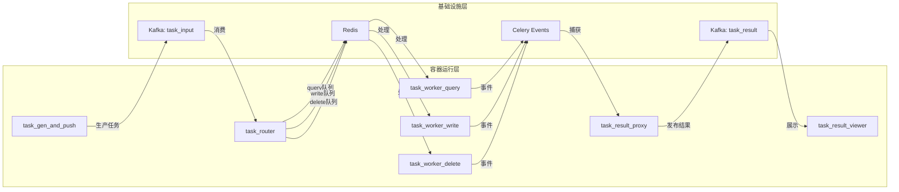
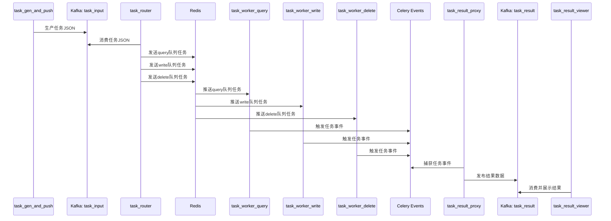
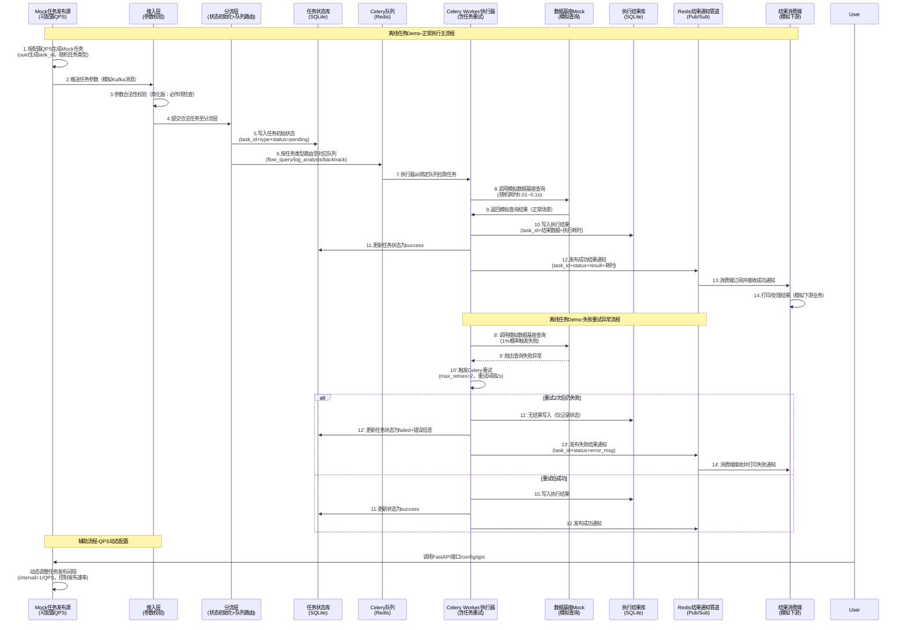
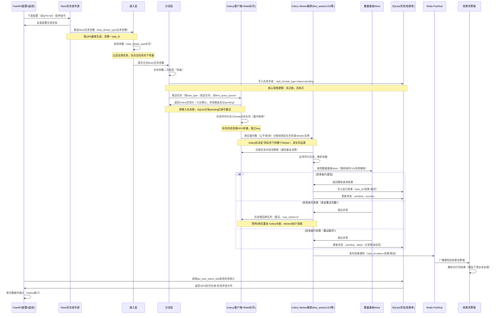
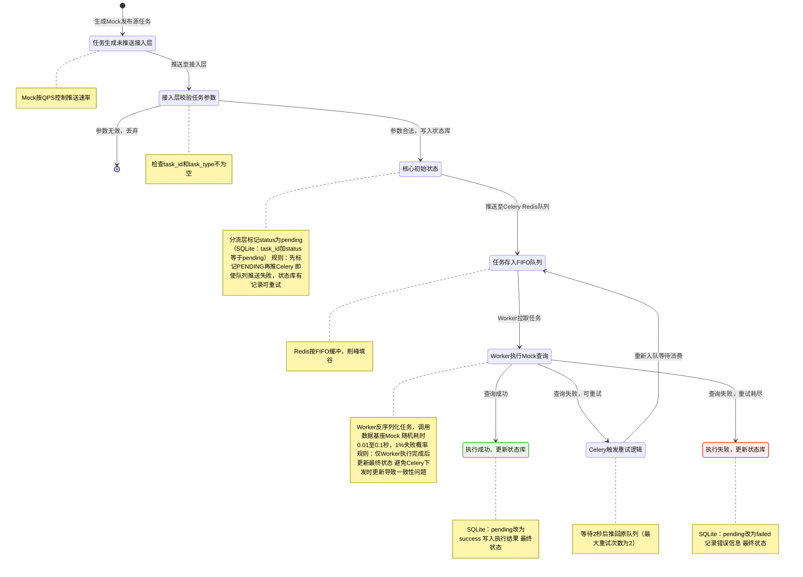

# task_flow_demo
A poc of a task distribution and execution framework. Using Kafka, FastAPI and Celery+Redis

```mermaid
flowchart LR
    subgraph Runtime["容器运行层"]
        GEN["task_gen_and_push"]
        ROUTER["task_router"]
        WQ["task_worker_query"]
        WW["task_worker_write"]
        WD["task_worker_delete"]
        RP["task_result_proxy"]
        RV["task_result_viewer"]
    end

    subgraph Infra["基础设施层"]
        KIN["Kafka: task_input"]
        KOUT["Kafka: task_result"]
        REDIS["Redis"]
        CEVT["Celery Events"]
    end

    GEN -->|生产任务| KIN
    KIN -->|消费| ROUTER
    
    ROUTER -->|query队列| REDIS
    ROUTER -->|write队列| REDIS
    ROUTER -->|delete队列| REDIS

    REDIS -->|处理| WQ
    REDIS -->|处理| WW
    REDIS -->|处理| WD

    WQ -->|事件| CEVT
    WW -->|事件| CEVT
    WD -->|事件| CEVT

    CEVT -->|捕获| RP
    RP -->|发布结果| KOUT
    KOUT -->|展示| RV
```
简化时序图

```mermaid
sequenceDiagram
    participant GEN as task_gen_and_push
    participant KIN as Kafka: task_input
    participant ROUTER as task_router
    participant REDIS as Redis
    participant WQ as task_worker_query
    participant WW as task_worker_write
    participant WD as task_worker_delete
    participant CEVT as Celery Events
    participant RP as task_result_proxy
    participant KOUT as Kafka: task_result
    participant RV as task_result_viewer

    %% 核心流程：任务生成 → 路由 → Worker处理 → 结果推送 → 结果展示
    GEN->>KIN: 生产任务JSON
    ROUTER->>KIN: 消费任务JSON
    ROUTER->>REDIS: 发送query队列任务
    ROUTER->>REDIS: 发送write队列任务
    ROUTER->>REDIS: 发送delete队列任务
    
    REDIS->>WQ: 推送query队列任务
    REDIS->>WW: 推送write队列任务
    REDIS->>WD: 推送delete队列任务
    
    WQ->>CEVT: 触发任务事件
    WW->>CEVT: 触发任务事件
    WD->>CEVT: 触发任务事件
    
    RP->>CEVT: 捕获任务事件
    RP->>KOUT: 发布结果数据
    RV->>KOUT: 消费并展示结果
```
分层时序图

```mermaid
sequenceDiagram
    participant Mocker as Mock任务发布源<br/>(可配置QPS)
    participant Access as 接入层<br/>(参数校验)
    participant Route as 分流层<br/>(状态初始化+队列路由)
    participant StatusDB as 任务状态库<br/>(SQLite)
    participant CeleryQ as Celery队列<br/>(Redis)
    participant Exec as Celery Worker/执行器<br/>(含任务重试)
    participant DataMock as 数据基座Mock<br/>(模拟查询)
    participant ResultDB as 执行结果库<br/>(SQLite)
    participant RedisPub as Redis结果通知管道<br/>(Pub/Sub)
    participant Consumer as 结果消费端<br/>(模拟下游)

    Note over Mocker,Consumer: 离线任务Demo-正常执行主流程
    Mocker->>Mocker: 1.按配置QPS生成Mock任务<br/>(uuid生成task_id，随机任务类型)
    Mocker->>Access: 2.推送任务参数（模拟Kafka消息）
    Access->>Access: 3.参数合法性校验（简化版：必传项检查）
    Access->>Route: 4.提交合法任务至分流层
    Route->>StatusDB: 5.写入任务初始状态<br/>(task_id+type+status=pending)
    Route->>CeleryQ: 6.按任务类型路由至对应队列<br/>(flow_query/log_analysis/backtrack)
    CeleryQ->>Exec: 7.执行器从绑定队列拉取任务
    Exec->>DataMock: 8.调用模拟数据基座查询<br/>(随机耗时0.01~0.1s)
    DataMock->>Exec: 9.返回模拟查询结果（正常场景）
    Exec->>ResultDB: 10.写入执行结果<br/>(task_id+结果数据+执行耗时)
    Exec->>StatusDB: 11.更新任务状态为success
    Exec->>RedisPub: 12.发布成功结果通知<br/>(task_id+status+result+耗时)
    RedisPub->>Consumer: 13.消费端订阅并接收成功通知
    Consumer->>Consumer: 14.打印/处理结果（模拟下游业务）

    Note over Exec,RedisPub: 离线任务Demo-失败重试异常流程
    Exec->>DataMock: 8'.调用模拟数据基座查询<br/>(1%概率触发失败)
    DataMock-->>Exec: 9'.抛出查询失败异常
    Exec->>Exec: 10'.触发Celery重试<br/>(max_retries=2，重试间隔2s)
    alt 重试2次后仍失败
        Exec->>ResultDB: 11'.无结果写入（仅记录状态）
        Exec->>StatusDB: 12'.更新任务状态为failed+错误信息
        Exec->>RedisPub: 13'.发布失败结果通知<br/>(task_id+status+error_msg)
        RedisPub->>Consumer: 14'.消费端接收并打印失败通知
    else 重试后成功
        Exec->>ResultDB: 10.写入执行结果
        Exec->>StatusDB: 11.更新状态为success
        Exec->>RedisPub: 12.发布成功通知
    end

    Note over Mocker,Access: 辅助流程-QPS动态配置
    User->>Mocker: 调用FastAPI接口/config/qps
    Mocker->>Mocker: 动态调整任务发布间隔<br/>(interval=1/QPS，控制发布速率)
```

```mermaid
sequenceDiagram
    participant A as FastAPI(配置&监控)
    participant B as Mock任务发布源
    participant C as 接入层
    participant D as 分流层
    participant E as Celery(客户端+Redis队列)
    participant F as Celery Worker集群(flow_worker1/2/3等)
    participant G as 数据基座Mock
    participant H as SQLite(状态/结果库)
    participant I as Redis Pub/Sub
    participant J as 结果消费端

    %% 1. 配置层：动态管控Mock发布源
    A->>B: 下发配置（如QPS=50）/启停指令
    B->>A: 反馈配置生效状态

    %% 2. Mock发布源：生成任务并推送
    B->>C: 推送Mock任务参数（task_id/task_type/业务参数）
    note over B,C: 按QPS速率生成，含唯一task_id

    %% 3. 接入层：前置参数校验
    C->>C: 校验参数（task_id/task_type非空）
    note over C: 过滤无效任务，仅合法任务向下传递
    C->>D: 提交合法Mock任务参数

    %% 4. 分流层：业务核心（先标记pending→再推Celery）
    D->>D: 业务参数二次校验（兜底）
    D->>H: 写入任务状态：task_id+task_type+status=pending
    note over D,H: 核心容错逻辑：先记账，后执行
    D->>E: 推送任务（按task_type→指定队列，如flow_query_queue）
    E->>D: 返回Celery任务ID（入队确认，非依赖此标记pending）
    note over D,E: 即使入队失败，SQLite已有pending记录可重试

    %% 5. Celery：技术层调度（缓冲+实例分配）
    E->>E: 任务序列化存入Redis对应队列（缓冲削峰）
    note over E: 队列内任务按FIFO存储，独立Key
    E->>F: 按负载均衡（公平/轮询）分配给绑定队列的某Worker实例
    note over E,F: Celery仅决定“同队列下的哪个Worker”，非队列品类
    F->>E: 拉取任务并加消费锁（避免重复消费）

    %% 6. Worker：任务执行+最终状态更新
    F->>F: 反序列化任务，解析参数
    F->>G: 调用数据基座Mock（随机耗时/1%失败概率）
    alt 任务执行成功
        G->>F: 返回模拟查询结果
        F->>H: 写入执行结果（task_id+结果+耗时）
        F->>H: 更新状态：pending→success
    else 任务执行失败（未达重试次数）
        G->>F: 抛出异常
        F->>E: 任务推回原队列（重试，max_retries=2）
        note over F,E: 等待2秒后重复“Celery分配→Worker执行”流程
    else 任务执行失败（重试耗尽）
        G->>F: 抛出异常
        F->>H: 更新状态：pending→failed（记录错误信息）
    end

    %% 7. 结果通知：下游解耦
    F->>I: 发布结果通知（task_id+status+结果/错误）
    I->>J: 广播通知到结果消费端
    J->>J: 解析并打印结果（模拟下游业务处理）

    %% 8. 监控层：状态查询
    A->>H: 调用get_task_status_stat查询状态统计
    H->>A: 返回QPS/队列长度/任务状态分布
    A->>A: 聚合数据并展示（/status接口）
```

任务状态流转

```mermaid
stateDiagram-v2
    %% 样式定义（严格遵循官方语法）
    classDef coreState fill:#E8F4FD,stroke:#2196F3,stroke-width:2px
    classDef errorState fill:#FFEBEE,stroke:#F44336,stroke-width:2px
    classDef successState fill:#E8F5E8,stroke:#4CAF50,stroke-width:2px
    classDef middleState fill:#FFF3E0,stroke:#FF9800,stroke-width:2px

    %% 状态流转（描述仅保留核心语义，无任何特殊字符）
    [*] --> 未提交 : 生成Mock发布源任务
    未提交 : 任务生成未推送接入层
    未提交 --> 提交校验中 : 推送至接入层
    提交校验中 : 接入层校验任务参数
    提交校验中 --> [*] : 参数无效，丢弃
    提交校验中 --> PENDING : 参数合法，写入状态库
    PENDING:::coreState : 核心初始状态
    PENDING --> 队列缓冲中 : 推送至Celery Redis队列
    队列缓冲中:::middleState : 任务存入FIFO队列
    队列缓冲中 --> 执行中 : Worker拉取任务
    执行中:::middleState : Worker执行Mock查询
    执行中 --> SUCCESS:::successState : 查询成功
    SUCCESS : 执行成功，更新状态库
    执行中 --> 重试中 : 查询失败，可重试
    重试中:::middleState : Celery触发重试逻辑
    重试中 --> 队列缓冲中 : 重新入队等待消费
    执行中 --> FAILED:::errorState : 查询失败，重试耗尽
    FAILED : 执行失败，更新状态库

    %% 所有备注仅用纯自然语言，移除所有特殊符号和HTML标签
    note right of 未提交: Mock按QPS控制推送速率
    note right of 提交校验中: 检查task_id和task_type不为空
    note right of PENDING: 分流层标记status为pending（SQLite：task_id加status等于pending） 规则：先标记PENDING再推Celery 即使队列推送失败，状态库有记录可重试
    note right of 队列缓冲中: Redis按FIFO缓冲，削峰填谷
    note right of 执行中: Worker反序列化任务，调用数据基座Mock 随机耗时0.01至0.1秒，1%失败概率 规则：仅Worker执行完成后更新最终状态 避免Celery下发时更新导致一致性问题
    note right of SUCCESS: SQLite：pending改为success 写入执行结果 最终状态
    note right of 重试中: 等待2秒后推回原队列（最大重试次数为2）
    note right of FAILED: SQLite：pending改为failed 记录错误信息 最终状态
```
